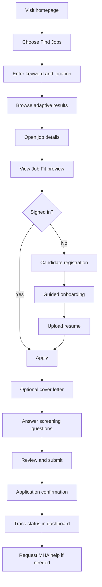
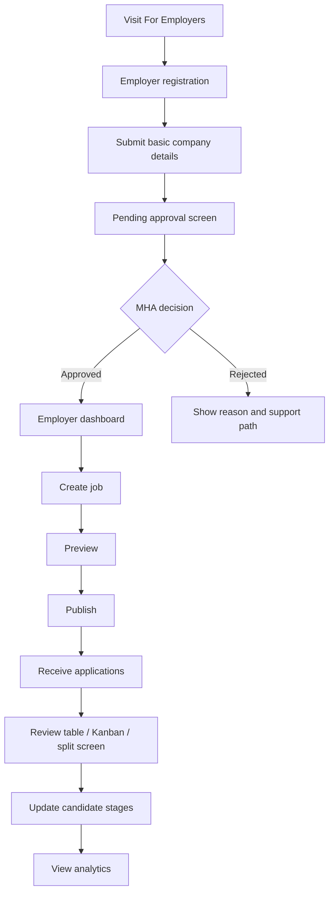
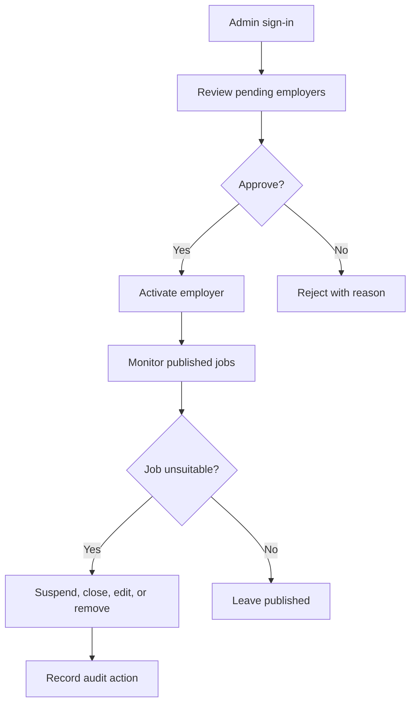

# MHA Consultancy Standalone Job Platform — Claude Executive Version
## Full MVP Product, UI/UX, Technical and Autonomous Multi-Agent Development Package

**Document status:** Approved Claude Code implementation baseline  
**Version:** 1.0 — Claude Executive Direction  
**Prepared for:** MHA Consultancy  
**Build approach:** Independent Claude Code implementation built from scratch  
**Frontend:** Next.js + TypeScript  
**Backend:** Django + Django REST Framework  
**Primary database:** PostgreSQL  
**Initial environment:** Local development only  
**Languages:** English and Simplified Chinese  
**Primary market:** Malaysia, designed for future Southeast Asia expansion  

**Repository expectation:** `talent-bridge-claude` (may be renamed before initial commit)  
**Autonomous branch:** `feat/claude-full-mvp`  
**Final merge policy:** normal merge commit; squash merging prohibited  
**Review model:** lead supervisor plus specialised implementation and read-only reviewer subagents  

---

# 1. Purpose of This Document

This document is the single source of truth for designing and building the first usable version of MHA Consultancy’s standalone job and recruitment platform.

It combines:

- Product and business requirements
- User roles and permissions
- Candidate, employer, and administrator workflows
- Full page and navigation requirements
- UI/UX direction
- Executive interaction, perspective-switching, and intelligence-console specifications
- Smart Job Fit requirements
- Backend architecture
- Database schema
- API structure
- Security and privacy requirements
- Local development setup
- Seed data and demo accounts
- Implementation phases
- Claude Code autonomous multi-agent implementation briefs
- Testing requirements
- Acceptance criteria
- Final review checklist

Claude Code, the lead supervisor, and every relevant subagent must read the applicable source-of-truth sections before changing code. The implementation must be independent and must not copy source code from the comparison build.

---

# 2. Product Definition

## 2.1 Working product name

Use **MHA Jobs** as a temporary internal working name until MHA confirms the final public-facing product name.

The interface must make it clear that the platform is operated by **MHA Consultancy**.

## 2.2 Correct product category

This project must not be treated as a normal affiliate-content page or a single marketing landing page.

It is an:

> **MHA-owned recruitment and job platform that supports MHA-managed vacancies, approved employer job postings, and future referral or affiliate recruitment arrangements.**

## 2.3 Standalone status

For the MVP:

- The platform is completely separate from MHA’s current corporate website.
- It has its own frontend, backend, database, authentication, dashboards, and administration.
- It does not need to integrate with the MHA corporate website.
- It does not need to integrate with JobStreet, LinkedIn, Indeed, or other platforms.
- It should be architected so future integration, linking, single sign-on, APIs, or migration to a dedicated domain can be added without rebuilding the core system.

---

# 3. Product Vision

## 3.1 Vision statement

Build a premium, bilingual recruitment and career-intelligence platform that combines MHA Consultancy’s human expertise with structured digital workflows, transparent opportunities, and professional hiring tools.

The Claude Executive Version must deliver the same complete product scope as the comparison build while presenting a clearly different visual and interaction direction.

## 3.2 Desired first impression

Within the first five seconds, the platform should feel:

- Professional and credible
- Premium without becoming luxurious or exclusive
- Modern and technology-enabled
- Structured, calm, and confident
- Human and consultative
- Data-aware rather than data-decorated
- Distinct from conventional recruitment portals
- Clearly operated under MHA Consultancy branding

It must not feel:

- Playful, cartoon-led, or youth-oriented
- Like a gaming interface
- Like a generic SaaS dashboard template
- Like a copied JobStreet, LinkedIn, Indeed, or recruitment-agency website
- Visually loud, over-animated, or dependent on gimmicks

## 3.3 Internal design concept

The approved internal design concept is:

> **The MHA Executive Talent Intelligence Platform**

Its signature experience combines:

1. An integrated executive homepage hero
2. Equal candidate and employer entry paths
3. A perspective-aware interface that adapts to the selected audience
4. An evidence-led Career Intelligence Console
5. Architectural editorial storytelling
6. MHA’s human consultant layer at high-value moments

The “wow” factor must come from composition, clarity, perspective switching, information design, and refinement—not from playful characters or excessive visual effects.

## 3.4 Core promise to candidates

> Discover relevant professional opportunities, understand why they may fit, track progress with clarity, and access MHA expertise when human guidance adds value.

## 3.5 Core promise to employers

> Plan and publish vacancies, review talent efficiently, manage the hiring pipeline clearly, and use credible recruitment insights with MHA support available when needed.

## 3.6 Comparison integrity

This version is an independent implementation by Claude Code.

It must preserve the same approved business rules, users, workflows, security requirements, localisation coverage, and feature scope as the comparison platform, while independently determining:

- Architecture details within the approved stack
- Repository organisation
- Component design
- API composition
- Service boundaries
- Test structure
- Visual execution
- Interaction implementation

No source code may be copied from the Codex implementation.

# 4. Confirmed Business Decisions

| Area | Confirmed decision |
|---|---|
| Launch market | Malaysia first, future Southeast Asia expansion |
| Candidate audience | General working professionals across career levels |
| Job focus | Office and professional roles |
| Platform ownership | Fully under MHA Consultancy branding |
| Job sources | MHA-managed jobs and approved employer partner jobs |
| Employer access | Employers create their own employer accounts |
| Employer approval | Manual approval by MHA administrator |
| Job publishing | Approved employers can publish immediately |
| Moderation | MHA can edit, suspend, close, or remove unsuitable jobs |
| Candidate application | Candidates apply directly through the platform |
| Candidate account | Required before applying |
| Candidate profile | Basic required profile with optional matching preferences |
| Employer dashboard | Job management, applicant management, analytics, guided actions |
| Payments | Excluded from MVP |
| Monetisation later | Free/basic posts, featured listings, subscriptions, success fees |
| Messaging | No built-in candidate-employer messaging in MVP |
| Communication | Email and phone contact outside the platform |
| Application workflow | Applied → Under Review → Shortlisted → Interview → Offered → Hired / Rejected |
| Search MVP | Keyword, location, employment type, salary range |
| Smart Job Fit | Rule-based score with optional AI explanation |
| Platform integration | Standalone; no external integration initially |
| Hosting | Local development only for now |
| Languages | English and Simplified Chinese |
| UI priority | Desktop-first, responsive adaptation |
| Development tool | Claude Code with project subagents and a lead supervisor |
| Delivery style | Full developer package and phased prompts |

---

# 5. Competitive Differentiation

The platform must not become “a standard job board with premium colours.”

Its differentiation comes from five connected signature systems.

## 5.1 Integrated executive hero

The first screen combines:

- A confident MHA recruitment statement
- Two equally prominent entry paths: Candidate and Employer
- A refined preview of the Career Intelligence Console
- An adaptive asymmetrical grid
- Professional human imagery
- Abstract, MHA-derived analytical graphics
- Restrained, purposeful motion

When the user selects a perspective, the hero grid may reorganise subtly to emphasise relevant language, calls to action, intelligence cards, and next steps.

## 5.2 Dual-perspective experience

Candidate and employer journeys must feel connected but distinct.

Candidate perspective emphasises:

- Opportunities
- Fit and career direction
- Application transparency
- Resume readiness
- MHA career support

Employer perspective emphasises:

- Vacancy planning
- Candidate quality and pipeline
- Hiring efficiency
- Market intelligence
- MHA recruitment support

Perspective switching must not create separate disconnected websites. Shared MHA credibility, navigation, design tokens, and data language must remain consistent.

## 5.3 Career Intelligence Console

The Career Intelligence Console is a signature presentation and information layer.

At launch, it may display:

- Administrator-managed hiring insights
- Popular role families
- Recruitment observations
- Salary guidance ranges where MHA has a reliable source
- Skills or employment trends supported by approved data
- Platform activity only when genuine platform data exists

As sufficient platform data becomes available, selected views may use real aggregated analytics.

Mandatory integrity rules:

- Never fabricate live counts
- Never imply real-time activity without real data
- Clearly distinguish MHA insight, platform analytics, and illustrative UI previews
- Hide metrics that lack reliable values
- Protect candidate and employer confidentiality
- Avoid small-group reporting that could identify individuals

## 5.4 Architectural storytelling

Public pages use:

- Strong editorial hierarchy
- Purposeful whitespace
- Asymmetrical but balanced grids
- Oversized headings used selectively
- Clear section sequencing
- Refined reveal transitions
- Data cards that support the narrative
- Professional photography placed as evidence of human recruitment, not decoration

Practical pages such as forms, dashboards, tables, and administration must remain calm and task-oriented.

## 5.5 Adaptive MHA expert layer

Self-service is the default. MHA support appears at high-value moments, including:

- Candidate career guidance
- Resume support
- Vacancy definition
- Difficult hiring stages
- Recruitment follow-up
- Support requests
- Job-linked assistance

The platform must communicate that technology improves access and clarity while MHA consultants remain available when judgement and human support matter.

## 5.6 Explainable Smart Job Fit

Candidates see:

- A transparent rule-based score
- Matched factors
- Gaps or uncertain factors
- A concise explanation
- A disclaimer that fit does not guarantee hiring

The system must not rank candidates for employers, make hiring decisions, or infer sensitive traits.

## 5.7 Transparent application journey

Candidates must always be able to understand:

- Current application stage
- Meaning of the stage
- Date of status changes
- Relevant next action
- Whether an update comes from the employer or platform workflow

## 5.8 Modern employer workspace

Employers must be able to:

- Review applicants in a table
- Track candidates on a Kanban board
- Review profile, resume, and answers in split-screen mode
- See reliable recruitment analytics
- Receive guided next-step prompts
- Request MHA support when needed

# 6. MVP Goals and Non-Goals

## 6.1 MVP goals

The MVP must allow:

1. Visitors to search and browse professional jobs.
2. Candidates to create accounts and profiles.
3. Candidates to upload resumes.
4. Candidates to apply directly to jobs.
5. Candidates to track application statuses.
6. Employers to register independently.
7. MHA administrators to approve or reject employers.
8. Approved employers to create, publish, edit, close, and reopen jobs.
9. Employers to review and manage applicants.
10. Employers to update recruitment stages.
11. MHA administrators to moderate jobs and users.
12. Candidates to receive a rule-based Job Fit score.
13. AI-generated Job Fit explanations when an AI provider is configured.
14. English and Simplified Chinese interface support.
15. The homepage to deliver the approved premium executive “wow” experience through perspective switching, architectural storytelling, and credible career intelligence.

## 6.2 Explicitly excluded from the MVP

Do not build these unless MHA approves a later phase:

- Online payment collection
- Subscription billing
- Paid featured listings
- Success-fee invoicing
- Built-in candidate-employer chat
- Video interviews
- Interview calendar scheduling
- Social networking
- Company reviews
- Candidate public networking profiles
- Automatic scraping of external job boards
- Automatic reposting from JobStreet or LinkedIn
- Automatic job-description translation
- Predictive hiring decisions
- AI candidate rejection
- AI candidate ranking for employers
- Native mobile applications
- Production hosting configuration
- Full Southeast Asia localisation
- Complex gamification
- Public salary predictions based on insufficient data

## 6.3 Future-ready, not future-built

The data model and application structure should make the following possible later without implementing their UI or workflows now:

- Payment plans
- Featured jobs
- Employer subscriptions
- Job alerts
- Expanded recommendations
- Traditional Chinese and Bahasa Malaysia
- Regional country settings
- Interview scheduling
- Secure in-platform messaging
- Additional AI career tools
- External ATS or job-board integrations
- Progressive Web App capabilities

---

# 7. Target Users and Personas

## 7.1 Candidate persona

A working professional in Malaysia who wants to:

- Find office or professional roles
- Search quickly
- Understand whether a role fits
- Apply without repeating information unnecessarily
- Track application progress
- Get help when unsure

Candidate experience tone:

- Friendly
- Encouraging
- Clear
- Energetic
- Respectful
- Never patronising

## 7.2 Employer persona

An approved company representative who wants to:

- Publish professional vacancies
- Receive applications
- Review resumes efficiently
- Move applicants through hiring stages
- Understand job performance
- Complete tasks with minimal training

Employer experience tone:

- Professional
- Efficient
- Confident
- Results-focused
- Clear

## 7.3 MHA administrator persona

An internal MHA team member who needs to:

- Review employer applications
- Approve or reject employer accounts
- Moderate jobs
- Handle support requests
- Manage users
- View audit records
- Correct operational problems quickly

Administrator tone:

- Direct
- Practical
- Operational

---

# 8. User Roles and Permission Model

## 8.1 Guest

Can:

- View homepage
- Search and browse published jobs
- View company pages
- View public career support content
- Change language
- Begin candidate or employer registration
- Run lightweight pre-signup job preference selection

Cannot:

- Apply
- Save jobs
- View private candidate information
- Access dashboards

## 8.2 Candidate

Can:

- Manage own profile
- Upload or replace own resume
- Save jobs
- Apply to published jobs
- Answer screening questions
- View own applications
- View own status history
- View Smart Job Fit
- Request MHA support
- Change language and account settings

Cannot:

- View other candidates
- View employer-only notes
- Change application status
- Access employer or admin functions

## 8.3 Pending employer

Can:

- Sign in
- Complete or update company profile
- View approval status
- Contact MHA for approval support
- Log out

Cannot:

- Publish jobs
- View applicants
- Use employer analytics

## 8.4 Approved employer

Can:

- Create draft jobs
- Preview jobs
- Publish jobs immediately
- Edit owned jobs
- Close or reopen owned jobs
- View applicants to owned jobs
- Update applicant statuses for owned jobs
- Add private internal notes
- Use applicant table, Kanban, and split-screen views
- View analytics for owned jobs

Cannot:

- Access another employer’s jobs or applicants
- Approve employers
- Remove MHA-owned jobs
- View candidate data outside an application to their company

## 8.5 Suspended employer

Can:

- Sign in
- View suspension notice
- View limited account information
- Contact MHA

Cannot:

- Publish or modify jobs
- View new candidate information
- Change applicant statuses

## 8.6 MHA administrator

Can:

- Approve, reject, suspend, or restore employers
- View and manage all jobs
- Publish MHA-owned jobs
- Moderate employer jobs
- View all applications where operationally necessary
- Manage candidates and employers
- Manage support requests
- View analytics
- View audit logs
- Manage bilingual static content where supported

---

# 9. Information Architecture

## 9.1 Public navigation

Main navigation:

- Find Jobs
- Explore Companies
- Career Support
- For Employers
- Sign In
- Create Account
- Language switcher

Candidate and employer journeys must be visually distinct without looking like separate brands.

## 9.2 Public routes

Recommended locale-prefixed route structure:

```text
/[locale]
/[locale]/jobs
/[locale]/jobs/[slug]
/[locale]/companies
/[locale]/companies/[slug]
/[locale]/career-support
/[locale]/for-employers
/[locale]/sign-in
/[locale]/register
/[locale]/register/candidate
/[locale]/register/employer
/[locale]/privacy
/[locale]/terms
```

Supported locale values:

```text
en
zh-CN
```

## 9.3 Candidate routes

```text
/[locale]/candidate/dashboard
/[locale]/candidate/profile
/[locale]/candidate/resume
/[locale]/candidate/applications
/[locale]/candidate/applications/[id]
/[locale]/candidate/saved-jobs
/[locale]/candidate/support
/[locale]/candidate/settings
```

## 9.4 Employer routes

```text
/[locale]/employer/dashboard
/[locale]/employer/pending
/[locale]/employer/company-profile
/[locale]/employer/jobs
/[locale]/employer/jobs/new
/[locale]/employer/jobs/[id]
/[locale]/employer/jobs/[id]/edit
/[locale]/employer/jobs/[id]/applicants
/[locale]/employer/analytics
/[locale]/employer/settings
```

## 9.5 Administrator interface

Use Django Admin as the primary internal MVP administration system.

Recommended admin areas:

- Users
- Candidate profiles
- Employer profiles
- Employer approval queue
- Jobs
- Applications
- Application histories
- Screening questions
- Support requests
- Saved jobs
- Job Fit results
- Audit logs
- Translation-managed static content, if applicable

Django Admin is an internal operational tool. Do not attempt to make it the public-facing website.

---

# 10. Primary User Journeys

## 10.1 Candidate journey



## 10.2 Employer journey



## 10.3 Administrator journey



---

# 11. UX Principles

## 11.1 Establish credibility immediately

The first screen must communicate MHA ownership, recruitment expertise, and the platform’s two-sided value without forcing users to scroll before understanding the product.

## 11.2 Equal candidate and employer clarity

Candidate and employer pathways must be unmistakable, equal in visual importance, and easy to change. No audience should feel like an afterthought.

## 11.3 Data must be credible

Every metric, trend, and insight must state or imply its source honestly. Do not display fake live counters, fabricated activity, or unsupported salary guidance.

## 11.4 Personalise without interrogating

Use progressive disclosure. Ask only for information needed at the current step. Explain why optional information improves matching or support.

## 11.5 Refinement must never block progress

Motion and adaptive layouts may improve orientation and create distinction, but they must not delay navigation, form completion, search, or dashboard tasks.

## 11.6 Explain rather than mystify

Job Fit, application stages, approval states, analytics, and moderation outcomes must be understandable. Avoid unexplained scores, opaque AI language, and vague system states.

## 11.7 Keep working screens calm

Dashboards, forms, applicant review, job management, and administration prioritise speed, hierarchy, density control, keyboard access, and predictable interaction.

## 11.8 Make next actions obvious

Every major screen should answer:

- Where am I?
- What is the current state?
- What should I do next?
- What happens after I do it?
- Where can I get MHA support?

## 11.9 Build trust into the interface

Use clear privacy language, secure file behaviour, visible organisation identity, accurate status messages, transparent validation, and restrained claims.

## 11.10 Design for reviewable outcomes

The implementation must be objectively reviewable through route inventories, screenshots, accessibility checks, responsive checks, translation coverage, test evidence, and documented data sources.

# 12. Visual Design Direction

## 12.1 Style

The approved style combines:

- Modern corporate technology
- Executive consultancy
- Architectural minimalism
- Editorial information hierarchy
- Human recruitment credibility
- Refined data visualisation

The visual system should feel premium through spacing, proportion, typography, material restraint, and consistency rather than decorative excess.

## 12.2 MHA brand treatment

MHA branding must be recognisable and balanced.

Requirements:

- Use official MHA logo assets without changing the logo geometry
- Extract the official primary and supporting colours from approved brand assets
- Do not invent final brand hex values when assets are unavailable
- Use MHA colour strongly enough to establish ownership
- Support MHA colour with white, warm neutral, charcoal, and grey surfaces
- Use darker MHA-derived tones for executive sections where contrast permits
- Use lighter MHA-derived tints for backgrounds and contextual highlights
- Use gradients only when derived from approved MHA colours and when they improve hierarchy
- Do not make every surface a brand colour
- Avoid unrelated neon, playful pastel, or fashionable accent palettes

## 12.3 Semantic design tokens

Define semantic tokens before implementing page-level styling.

Required token categories:

```text
--brand-primary
--brand-primary-strong
--brand-primary-soft
--brand-on-primary
--surface-canvas
--surface-raised
--surface-subtle
--surface-inverse
--text-primary
--text-secondary
--text-muted
--text-inverse
--border-default
--border-strong
--focus-ring
--status-info
--status-success
--status-warning
--status-danger
--data-series-1 through --data-series-6
```

The token system must support light and inverse sections without scattering raw colour values across components.

## 12.4 Typography

Typography should be:

- Clear and highly legible
- Professional rather than trendy
- Strong enough for editorial headlines
- Efficient for tables, forms, and dashboards
- Suitable for English and Simplified Chinese

Use a restrained scale with clearly documented roles for display, heading, body, label, caption, and data text.

Avoid:

- Extremely condensed display faces
- Excessive all-caps
- Decorative serif use in operational interfaces
- Tiny metadata text
- Oversized headings that cause poor wrapping in Chinese

## 12.5 Layout and geometry

Use:

- A consistent page grid
- Purposeful asymmetry on public storytelling pages
- Strong alignment anchors
- Generous but controlled whitespace
- Clear content density tiers
- Medium-radius or low-radius surfaces
- Borders and tonal separation before heavy shadows
- Consistent dashboard panels and data cards

The interface must not become an endless collection of rounded floating cards.

## 12.6 Photography and graphics

Use a hybrid visual approach:

- Selective professional photography
- Realistic workplace, interview, candidate, employer, and consultant contexts
- Abstract MHA-coloured analytical forms
- Refined charts and diagrams
- Original line, grid, or network graphics

Avoid:

- Generic cartoon people
- Playful mascots
- Unlicensed imagery
- AI-generated imagery presented as real MHA staff or clients
- Visually misleading dashboards
- Stock photography in every section

All final imagery must have documented licence or ownership status.

## 12.7 Visual personality boundaries

The product may feel:

- Confident
- Intelligent
- Measured
- Human
- Contemporary
- Distinctive
- Trustworthy

It must not feel:

- Childish
- Overly youthful
- Flashy
- Cold or inaccessible
- Luxury-fashion oriented
- Like a cryptocurrency dashboard
- Like a generic recruitment template
- Like an investor-relations site with no human warmth

# 13. Executive Interaction and Intelligence System

## 13.1 Purpose

The interaction system provides the approved “wow” factor without characters or novelty animation.

Its main functions are:

- Help users choose Candidate or Employer perspective
- Reorganise information around that choice
- Present credible intelligence clearly
- Guide attention through architectural storytelling
- Make complex workflows feel understandable
- Preserve fast, calm operational screens

## 13.2 Recommended technology

Use:

- One established React-compatible motion library for purposeful transitions
- CSS transitions for simple hover, focus, and disclosure states
- Accessible SVG or a suitable chart library for data visualisation
- Server-rendered static content where interaction is unnecessary
- Lazy-loaded client components for heavier interactive modules

Do not introduce a 3D engine, game engine, character runtime, or large animation framework without a demonstrated need and supervisor approval.

## 13.3 Perspective states

The public experience should support these states:

```text
neutral
candidate-focused
employer-focused
switching
loading-insight
insight-ready
reduced-motion
```

Perspective state may change:

- Hero copy
- Primary calls to action
- Highlighted intelligence cards
- Supporting imagery
- Journey preview
- MHA support prompts

Perspective state must not hide essential navigation or cause content to become inaccessible.

## 13.4 Integrated hero behaviour

The hero uses an adaptive asymmetrical grid.

Required elements:

- MHA brand identity
- Editorial headline
- Concise supporting statement
- Candidate and Employer perspective controls
- Relevant primary and secondary calls to action
- Career Intelligence Console preview
- Professional human imagery or approved visual placeholder
- Abstract analytical graphic derived from MHA colours

Interaction requirements:

- Perspective controls are keyboard accessible
- Selection updates relevant content without disorienting movement
- URL or session state may preserve the chosen perspective where helpful
- Content remains useful before JavaScript hydrates
- Motion is subtle and short
- Mobile uses a stacked, readable structure

## 13.5 Career Intelligence Console behaviour

The console must distinguish:

- `MHA insight`
- `Platform analytics`
- `Illustrative preview`

Every visible metric must have a valid source state.

Suggested modules:

- Roles in focus
- Hiring outlook
- Skills observed in approved insight content
- Salary guidance where available
- Candidate pathway prompts
- Employer hiring checklist
- Platform activity only when real aggregate data exists

The console is not a fake stock-market ticker. Avoid constant motion, flashing changes, and meaningless data density.

## 13.6 Motion system

Public pages may use:

- Short content reveals
- Grid rebalancing
- Controlled card emphasis
- Progressive chart drawing
- Subtle image masking
- Section-to-section continuity

Operational pages should use only:

- State transitions
- Disclosure movement
- Focus indication
- Progress feedback
- Drag-and-drop feedback with keyboard alternatives

## 13.7 Accessibility

Requirements:

- Respect `prefers-reduced-motion`
- Provide an explicit static alternative where motion communicates information
- Never rely on colour or movement alone
- Maintain logical reading and focus order during visual reorganisation
- Avoid scroll hijacking
- Avoid autoplay audio
- Avoid infinite motion that cannot be paused when it affects comprehension
- Ensure data visualisations include textual summaries

## 13.8 Performance

Requirements:

- Lazy-load non-critical visual modules
- Avoid layout shifts
- Pause off-screen continuous effects
- Keep public-page motion code out of dashboards
- Prefer CSS and SVG over video where suitable
- Optimise photography and use responsive images
- Measure bundle impact before accepting a visual dependency
- Provide static fallbacks for failed or disabled visual modules

# 14. Page-by-Page UI/UX Requirements

# 14.1 Homepage

## Objective

Present MHA as the trusted operator of a professional two-sided recruitment platform and immediately guide visitors into Candidate or Employer journeys while demonstrating credible career intelligence.

## Required section order

### A. Header

Include:

- Official MHA identity
- Jobs
- Companies
- Career Support
- For Employers
- Sign In
- Candidate registration action
- Employer registration action
- Language switcher

Requirements:

- Strong visual hierarchy without an oversized navigation bar
- Persistent but unobtrusive access to both audiences
- Locale switching preserves the current route where possible
- Mobile navigation remains fully keyboard and screen-reader accessible

### B. Integrated executive hero

Use an adaptive asymmetrical grid containing:

- A confident MHA recruitment headline
- A concise explanation of the platform
- Candidate and Employer perspective controls
- One primary and one secondary call to action for the selected perspective
- A Career Intelligence Console preview
- Selective professional imagery
- An abstract MHA-derived analytical visual

Candidate perspective should emphasise:

- Search professional opportunities
- Understand role fit
- Track applications
- Access career support

Employer perspective should emphasise:

- Plan and publish vacancies
- Review and manage applicants
- Understand recruitment progress
- Access MHA hiring support

Neutral state should explain the two-sided value before selection.

### C. Perspective value panel

Display three to four value pillars relevant to the selected audience.

Candidate examples:

- Transparent application tracking
- Explainable Job Fit
- Professional opportunities
- MHA guidance

Employer examples:

- Structured job publishing
- Efficient applicant review
- Pipeline visibility
- MHA recruitment expertise

The transition may be animated, but content must remain semantically present and accessible.

### D. Career Intelligence Console

Include a refined set of modules such as:

- Roles in focus
- Hiring or career insight
- Salary guidance when supported
- Skills or direction themes
- Relevant action prompt

At launch, use administrator-managed insight content or clearly labelled illustrative previews.

Never display invented “people online,” “applications today,” “live hires,” or other fake activity.

### E. Opportunities and organisations

Include:

- Latest or featured jobs based on real published data
- Company discovery based on approved employer profiles
- Clear empty states before seed or real data exists
- Direct links to search and company pages

Do not hard-code fake vacancy counts.

### F. How the journey works

Use an architectural step sequence rather than a playful timeline.

Candidate journey:

1. Create profile
2. Add resume
3. Discover opportunities
4. Apply
5. Track progress
6. Request help when needed

Employer journey:

1. Register organisation
2. Receive MHA approval
3. Publish vacancy
4. Review applicants
5. Progress candidates
6. Use insights and MHA support

### G. MHA expert layer

Explain where human expertise enters the experience.

Include relevant pathways such as:

- Ask MHA for career support
- Request resume help
- Get help defining a vacancy
- Request recruitment assistance

The section should feel consultative, not like a generic contact banner.

### H. Employer workspace preview

Show a polished but honest preview of:

- Attention queue
- Active jobs
- Applicant table
- Kanban pipeline
- Recruitment insights

Use real interface components or clearly identified product previews. Do not create misleading live data.

### I. Trust and operating model

Include:

- Operated by MHA Consultancy
- Employer approval explanation
- Privacy and secure resume handling
- Clear limits of Smart Job Fit
- Human support availability
- Responsible data use

Do not invent client logos, testimonials, awards, placements, or success rates.

### J. Final dual call to action

Provide equal Candidate and Employer next steps without repeating the entire hero.

### K. Footer

Include:

- MHA Consultancy identity
- Jobs
- Companies
- Career Support
- Employer access
- Privacy
- Terms
- Contact or support route
- Language switcher

## Homepage quality requirements

- Distinct from a standard recruitment template
- Strong MHA recognition
- No cartoon characters or playful mascots
- No fake live counters
- No scroll hijacking
- Meaningful reduced-motion version
- Mobile composition designed intentionally, not merely collapsed
- Initial search or primary action available within the first viewport
- All visual modules have loading, empty, error, and fallback states where applicable

# 14.2 Job Search Results

## Desktop layout

Use adaptive split-screen browsing:

- Left: search controls and job list
- Right: selected job preview
- Full job-detail route remains available

## Smaller-screen layout

- Full-width job list
- Filters in collapsible panel or drawer
- Job detail opens as a separate page

## Filters

MVP filters:

- Keyword
- Location
- Employment type
- Salary minimum and maximum

## Sorting

Include:

- Newest
- Most Relevant

## Job card

Default visible information:

- Job title
- Company
- Location
- Salary or “Salary not disclosed”
- Employment type
- Date posted
- Approved employer badge where applicable
- MHA Recruiter Supported badge where applicable
- Easy Apply indicator

Adaptive reveal on hover, focus, or expansion:

- Short requirement preview
- Application deadline
- Short Job Fit indicators when signed in
- Quick actions

## Card interaction

- Full keyboard access
- Clear selected state
- No layout shift that makes comparison difficult
- Expand/tap alternative for non-hover devices
- Skeleton loading during result changes

## Empty state

Use a concise, professional guidance panel with practical suggestions:

- Adjust location
- Broaden keyword
- Remove salary limit
- Ask MHA for help

---

# 14.3 Job Detail Page

## Decision-first header

Show, when available:

- Job title
- Company
- Company logo
- Location
- Employment type
- Salary
- Date posted
- Application deadline
- Approved employer badge
- MHA-supported badge

## Primary actions

- Apply Now
- Save Job
- Share Job

Desktop:

- Sticky application panel

Mobile:

- Sticky bottom action bar

## Main sections

1. Job overview
2. Job description
3. Requirements
4. Smart Job Fit
5. Screening-question preview, where relevant
6. Company overview
7. Company culture and benefits, where available
8. Similar jobs
9. MHA support prompt

## Application-state behaviour

If already applied:

- Replace Apply Now with View Application
- Show current stage
- Show submission date
- Prevent duplicate application

## Missing-data behaviour

Conditionally hide unavailable optional information. Do not show empty labels or placeholder text to public users.

---

# 14.4 Explore Companies

## Company directory

Include:

- Search by company name
- Company cards
- Logo
- Short description
- Location, if provided
- Active job count
- Approved employer badge

## Company detail

Include:

- Logo
- Company name
- Approved employer status
- Short description
- Optional culture and benefits
- Active jobs
- Contact details only where appropriate

Do not include public employee reviews in the MVP.

---

# 14.5 Career Support

Include:

- Clear explanation of MHA support
- Support request form
- Resume submission option
- Common help categories:
  - Job application
  - Resume
  - Career direction
  - Application status
  - Other
- Response expectation copy
- Privacy notice

No live chat is required.

---

# 14.6 Sign-In and Account Selection

## Account-selection screen

Clearly show two routes:

- I am looking for a job
- I am hiring talent

The page composition and supporting guidance should adapt subtly to the selected route.

## Sign-in

- Email
- Password
- Show/hide password
- Remember me, if securely implemented
- Forgot password
- Correct role-aware redirect

Do not create completely separate authentication systems for candidates and employers. Use one user model with role-specific profiles and journeys.

---

# 14.7 Candidate Registration and Onboarding

## Step structure

Recommended:

1. Account
2. Basic Profile
3. Career Preferences
4. Resume
5. Ready

## Required registration data

- Full name
- Email
- Password
- Phone
- Preferred job or role
- Resume before first application

## Optional matching preferences

- Preferred location
- Preferred employment type

## UX requirements

- Progress indicator
- Save progress where practical
- Clear password requirements
- Inline validation
- Encouraging but professional microcopy
- Success screen with recommended jobs
- English and Simplified Chinese support

---

# 14.8 Employer Registration and Approval

## Registration fields

Required:

- Company name
- Work email
- Password
- Contact person
- Phone number

## Approval process

1. Employer submits registration.
2. Account enters Pending status.
3. MHA administrator reviews it manually.
4. Administrator approves or rejects.
5. Employer sees result after sign-in.
6. Send transactional email when configured.

## Pending screen

Show:

- Approval status
- Submitted information
- Expected next step
- Contact MHA action
- Ability to correct allowed company details

## Rejection screen

Show:

- Clear non-sensitive reason
- Update-and-resubmit option where allowed
- Contact MHA action

---

# 14.9 Candidate Dashboard

Use a “career command centre” structure.

## Priority order

### A. Welcome and next action

Examples:

- Complete your profile
- Upload a newer resume
- Review a matching job
- Check an updated application

### B. Application snapshot

Counts by:

- Applied
- Under Review
- Shortlisted
- Interview
- Offered
- Hired

Do not present Rejected as an achievement metric.

### C. Application journey

Visual status timeline with:

- Current stage
- Date changed
- Stage explanation
- Next action, if known

### D. Jobs picked for you

Use profile preferences and match rules.

### E. Resume and profile

- Resume file name
- Upload date
- Replace action
- Profile completion
- Edit profile

### F. Encouraging insights

Examples:

- New matching jobs
- Applications updated
- Suggested next step

Avoid childish badges or forced streaks.

---

# 14.10 Employer Dashboard

Use a guided recruitment workspace.

## Priority order

### A. Attention queue

Examples:

- New applicants
- Jobs near deadline
- Draft job not published
- Candidates awaiting review

### B. Quick actions

- Post a Job
- Review Applicants
- View Active Jobs
- View Analytics

### C. Active jobs

Show:

- Views
- Applications
- New applicants
- Status
- Deadline

### D. Candidate pipeline

Counts by stage.

### E. Recruitment insights

Use reliable data only:

- Views
- Applications
- Application conversion rate
- Time to first application
- Stage distribution

### F. Guided setup

For new employers:

- Complete company profile
- Publish first job
- Review first applicant

Do not show payment or billing modules in the MVP.

---

# 14.11 Job Creation and Management

## Required job fields

- Job title
- Company
- Location
- Employment type
- Salary
- Job description
- Requirements
- Application deadline

## Salary structure

Support:

- Minimum salary
- Maximum salary
- Currency
- Salary period
- “Salary not disclosed”

## Job actions

- Save draft
- Preview
- Publish
- Edit
- Close
- Reopen
- Duplicate, optional if low effort

## Job statuses

```text
DRAFT
PUBLISHED
CLOSED
SUSPENDED
EXPIRED
ARCHIVED
```

Approved employers can publish immediately.

MHA administrators can suspend, close, edit, or remove jobs.

## Screening questions

Employers may add optional screening questions.

Supported MVP types:

- Short text
- Long text
- Yes / No
- Single choice
- Number

Questions may be marked required.

---

# 14.12 Applicant Management

Employers can switch among three views.

## Table view

Columns:

- Candidate
- Job
- Applied date
- Current status
- Resume
- Last updated
- Actions

Support:

- Search
- Status filter
- Sort
- Bulk status update only if safely implemented

## Kanban view

Columns:

- Applied
- Under Review
- Shortlisted
- Interview
- Offered
- Hired
- Rejected

Requirements:

- Drag and drop
- Keyboard-accessible movement alternative
- Confirmation for rejection
- Optimistic UI with rollback on API failure
- Status history created for every change

## Split-screen review

Default for reviewing a specific vacancy:

Left:

- Candidate list
- Search and filters

Right:

- Candidate profile
- Resume preview or download
- Screening answers
- Cover letter
- Current stage
- Private notes
- Stage controls

Employers must not see candidates who did not apply to their jobs.

---

# 14.13 MHA Administration

The MVP admin system should support:

## Employer approvals

- Pending queue
- View submitted details
- Approve
- Reject with reason
- Suspend
- Restore
- Approval history

## Job moderation

- View all jobs
- Filter by employer and status
- Suspend
- Close
- Edit
- Remove
- Mark MHA-supported
- Record moderation reason

## Candidate management

- View account status
- Deactivate or restore account
- View operational application history
- Do not casually expose resumes to all staff

## Support requests

- New
- In progress
- Resolved
- Closed

## Audit logs

Record sensitive administrative actions.

---

# 15. Functional Requirements

# 15.1 Authentication

- Email is the account identifier.
- Use one custom Django user model from project start.
- Roles are candidate, employer, and administrator.
- Passwords use Django’s password system.
- Email verification should be supported.
- Password reset should be supported.
- Role changes require administrative action.
- Never store passwords or long-lived tokens in browser local storage.

# 15.2 Transactional emails

When email delivery is configured, support:

- Account verification
- Password reset
- Employer approval
- Employer rejection
- Application confirmation
- Application status change
- Support request confirmation

For local development, use console or file-based email backend.

# 15.3 Job search

- Public read access to published, non-expired jobs
- Case-insensitive keyword search
- Location filter
- Employment type filter
- Salary filter
- Pagination
- Stable sorting
- Search-state persistence in URL query parameters
- No search result should expose draft, suspended, or archived jobs

# 15.4 Applications

- Candidate must be signed in.
- Candidate must have a resume.
- Candidate can apply only once per job.
- Application stores a snapshot reference to the resume used.
- Optional cover letter.
- Required screening answers must be validated.
- Employer can update status only for applications to owned jobs.
- Every status change creates a history record.
- Candidate sees current stage and history.
- Employer private notes are never shown to candidate.

# 15.5 Saved jobs

Include lightweight saved jobs in the MVP because it is part of the approved job-detail experience.

- Candidate-only
- Save and unsave
- Prevent duplicates
- Remove or label jobs that are no longer available

# 15.6 Sharing

Support copying a public job URL and native share API where available.

# 15.7 Career support

- Guests and candidates may submit support requests.
- Candidate requests link to the user account where available.
- Job-specific requests may link to a job.
- MHA administrators can manage status.
- No live chat.

# 15.8 Analytics

## Public

Only reliable aggregated values:

- Published job count
- Approved employer count
- Recent job count
- Popular locations
- Popular role keywords

## Candidate

- Matching-job count
- Application stage counts
- Recent status updates

## Employer

- Job views
- Applications
- Conversion rate
- Time to first application
- Stage distribution

## Privacy

Do not expose:

- Individual candidate activity
- Sensitive candidate attributes
- Cross-employer applicant data

---

# 16. Smart Job Fit Specification

## 16.1 Purpose

Help candidates understand whether a job appears aligned with their stated preferences and resume.

It must not:

- Guarantee interview or hiring
- Make final hiring decisions
- Reject candidates
- Infer sensitive personal characteristics
- Rank candidates for employers in the MVP

## 16.2 Reliable rule-based foundation

Recommended score:

| Factor | Weight |
|---|---:|
| Preferred role or title similarity | 35 |
| Preferred location match | 25 |
| Preferred employment type match | 20 |
| Resume-to-requirements keyword overlap | 20 |
| **Total** | **100** |

If a factor lacks usable data:

- Exclude it from the denominator.
- Re-normalise the remaining factors.
- Clearly label the score as based on available information.

## 16.3 Match bands

```text
80–100: Strong match
60–79: Good potential match
40–59: Partial match
0–39: Limited match
```

These labels are guidance only.

## 16.4 Rule-based explanation structure

Always produce structured reasons first.

Example:

```json
{
  "score": 82,
  "band": "strong",
  "matched": [
    "Matches your preferred location",
    "Matches your preferred employment type",
    "Several requirement keywords appear in your resume"
  ],
  "gaps": [
    "The job title is related but not an exact match"
  ],
  "unknown": [
    "Salary preference is not available"
  ]
}
```

## 16.5 Optional AI explanation

When an AI provider is configured:

- Send only the minimum necessary structured match facts.
- Do not send the full resume unless specifically approved and protected.
- Ask the model to rewrite facts into short friendly language.
- Do not let the model change the numeric score.
- Do not allow unsupported claims.
- Store provider and model metadata.
- Provide deterministic fallback text if the AI request fails.

## 16.6 Example candidate-facing output

> **Strong match — 82%**  
> This position matches your preferred location and employment type. Several skills mentioned in the job requirements also appear in your resume. The job title is related to your preferred role, although it is not an exact match.

Required disclaimer:

> Job Fit is guidance based on available information and does not guarantee an interview or employment outcome.

## 16.7 AI provider interface

Use a provider-neutral service contract.

Suggested backend interface:

```python
class JobFitExplanationProvider(Protocol):
    def generate_explanation(
        self,
        *,
        locale: str,
        score: int,
        band: str,
        matched: list[str],
        gaps: list[str],
        unknown: list[str],
    ) -> str:
        ...
```

Configuration:

```text
AI_JOB_FIT_ENABLED=false
AI_PROVIDER=
AI_MODEL=
AI_API_KEY=
```

When disabled, return structured fallback copy.

---

# 17. Content and Language Requirements

## 17.1 Interface languages

- English
- Simplified Chinese

## 17.2 Locale behaviour

- Use locale-prefixed routes.
- Remember selected language.
- Allow explicit switching.
- Keep the user on the equivalent route when switching language.
- Set the document `lang` attribute correctly.

## 17.3 Job-listing language

- Store the language entered by the employer.
- Do not automatically translate job descriptions.
- Display a clear language indicator when helpful.
- Search should work on the stored listing content.

## 17.4 Translation structure

Use namespaced translation files.

Example:

```text
messages/
  en/
    common.json
    home.json
    jobs.json
    candidate.json
    employer.json
    auth.json
    validation.json
  zh-CN/
    common.json
    home.json
    jobs.json
    candidate.json
    employer.json
    auth.json
    validation.json
```

## 17.5 Copy tone

Candidate:

- Friendly
- Encouraging
- Energetic
- Supportive

Employer:

- Professional
- Efficient
- Results-focused

System errors:

- Clear
- Calm
- Actionable
- Never blame the user

---

# 18. Technical Architecture

## 18.1 Recommended architecture

```text
Browser
  |
  v
Next.js Frontend
  |
  | HTTPS REST API
  v
Django + Django REST Framework
  |
  +--> PostgreSQL
  |
  +--> Local private media storage for development
  |
  +--> Optional AI provider
  |
  +--> Local console/file email backend
```

## 18.2 Frontend

Use:

- Next.js App Router
- TypeScript
- Server Components where suitable
- Client Components only for interactive areas
- A reusable design system
- One approved React-compatible motion library for purposeful public-page interaction
- An accessible SVG or chart solution for analytical visualisation
- A form library with schema validation
- A query/data-fetching approach with caching and mutation handling
- Accessible component primitives

Do not tightly couple business logic to visual components.

## 18.3 Backend

Use:

- Django
- Django REST Framework
- PostgreSQL
- Custom user model
- Service layer for complex domain operations
- Django Admin for internal management
- Object-level authorization checks
- API version prefix such as `/api/v1/`

## 18.4 Repository recommendation

Use a monorepo-style folder containing separate applications.

```text
mha-jobs/
  frontend/
  backend/
  docs/
  scripts/
  docker-compose.yml
  .env.example
  README.md
```

## 18.5 Suggested backend apps

```text
backend/
  config/
  apps/
    accounts/
    candidates/
    employers/
    jobs/
    applications/
    matching/
    support/
    analytics/
    audit/
```

## 18.6 Suggested frontend structure

```text
frontend/
  src/
    app/
      [locale]/
    components/
      ui/
      layout/
      intelligence/
      jobs/
      candidate/
      employer/
    features/
      auth/
      job-search/
      applications/
      job-fit/
    lib/
      api/
      auth/
      i18n/
      validation/
    messages/
    styles/
```

---


# 18.7 Non-Negotiable Code Organisation Standards

The repository must remain clean, tidy, predictable, and easy for another developer to understand.

This is a mandatory engineering requirement, not an optional style preference.

## General rules

1. Every code file must be stored in the folder that owns its responsibility.
2. Do not place feature code, helper files, components, API logic, or temporary files in the repository root.
3. The repository root should contain only project-level configuration, documentation, orchestration files, and top-level folders.
4. Do not create vague dumping folders such as `misc`, `others`, `common-stuff`, `temp`, or `new`.
5. Do not leave duplicate, backup, abandoned, or experimental files such as:
   - `Component-old.tsx`
   - `Component-copy.tsx`
   - `views_backup.py`
   - `test2.js`
   - `final-final.tsx`
6. Remove obsolete files only after confirming they are no longer imported or required.
7. Do not mix unrelated responsibilities inside one file.
8. Prefer small, focused modules with clear names over very large multipurpose files.
9. Reusable logic must be extracted into the correct shared or feature-specific module rather than copied.
10. Do not create a new shared abstraction until it is genuinely reused or clearly belongs to a cross-cutting concern.
11. Keep route and page files focused on composition and orchestration. Move complex UI, validation, data access, and business logic into their proper modules.
12. Keep business rules in the Django domain or service layer. Do not duplicate authoritative business logic in React components.
13. Centralise frontend API access instead of scattering raw `fetch` calls throughout components.
14. Keep environment-specific configuration in environment files or configuration modules. Do not hardcode URLs, secrets, ports, or credentials.
15. Generated files, local uploads, caches, logs, build output, and editor files must be excluded through `.gitignore`.
16. Every new folder and important architectural convention must be documented in the README or architecture documentation.
17. Before creating a new file, determine:
    - Which feature owns it?
    - Is an existing file the correct location?
    - Is it reusable or feature-specific?
    - Does the proposed name clearly describe its purpose?

## Frontend folder ownership

Use a predictable structure such as:

```text
frontend/src/
  app/
    [locale]/
      (public)/
      (auth)/
      candidate/
      employer/
  components/
    ui/
    layout/
    intelligence/
  features/
    auth/
      components/
      hooks/
      schemas/
      services/
      types/
    jobs/
      components/
      hooks/
      schemas/
      services/
      types/
    applications/
    employers/
    candidates/
    matching/
    support/
    analytics/
  lib/
    api/
    auth/
    i18n/
    validation/
  styles/
  messages/
  types/
```

Frontend rules:

- Generic visual primitives belong in `components/ui`.
- Global layout components belong in `components/layout`.
- Feature-specific components belong inside the relevant `features/<feature>` folder.
- Page-specific components that are not reusable should remain close to the route that owns them.
- API clients and endpoint functions belong in a central API layer or the relevant feature service folder.
- Validation schemas belong in `schemas`.
- Feature-specific TypeScript types belong with the feature.
- Truly global types belong in the global `types` folder.
- Custom hooks must be placed with the feature they serve unless they are genuinely global.
- Do not put complex data-fetching, transformation, or business rules directly inside JSX.
- Do not build one oversized dashboard, form, or page component when it can be separated into meaningful sections.

## Backend folder ownership

Use clear Django applications and internal modules such as:

```text
backend/
  config/
  apps/
    accounts/
      models/
      serializers/
      services/
      permissions/
      api/
      tests/
    candidates/
    employers/
    jobs/
    applications/
    matching/
    support/
    analytics/
    audit/
```

A simpler flat module structure inside a small Django app is acceptable at first, but it must remain internally consistent. Do not create empty architectural layers merely for appearance.

Backend rules:

- Models belong to the Django app that owns the domain concept.
- Serializers handle API validation and representation, not complex business workflows.
- Views or viewsets coordinate requests and responses; they should not contain large business processes.
- Complex use cases belong in clearly named service functions or service classes.
- Reusable query logic may belong in selectors, querysets, or managers.
- Permission rules belong in explicit permission modules or domain policies.
- URL definitions stay within the relevant app.
- Signals must be used sparingly and never hide important business workflows.
- Tests belong to the app and feature they verify.
- Migrations must remain in the owning app’s `migrations` folder.
- Management commands belong in the relevant app’s `management/commands` folder.
- Do not create circular dependencies between Django apps.
- Avoid a generic `utils.py` containing unrelated functions. Use purpose-specific module names.

## Naming rules

- Use descriptive names that communicate business meaning.
- Use consistent naming conventions across the repository.
- Avoid unexplained abbreviations.
- Name Boolean values with clear prefixes such as `is_`, `has_`, `can_`, or `should_`.
- Name event handlers and actions according to the action performed.
- Name files according to the primary component, service, model, or responsibility they contain.
- Keep API, database, frontend, and documentation terminology aligned with this specification.

## File-size and responsibility review

There is no arbitrary line-count limit, but the developer must review a file for separation when:

- It owns several unrelated responsibilities.
- It becomes difficult to navigate or test.
- Multiple screens or workflows are implemented in one component.
- Business rules, API access, state management, and presentation are mixed together.
- A change to one feature risks breaking unrelated behaviour.

Split files according to meaningful responsibilities, not merely to reduce line count.

## Required file-change reporting

After every implementation phase, the coding assistant must provide:

1. Files created
2. Files modified
3. Files moved
4. Files deleted
5. The purpose of each change
6. Confirmation that no temporary, duplicate, or unused files were left behind
7. Confirmation that imports and tests still pass after any file movement

The phase is not complete if the repository is left disorganised, contains dead files, or places code in inappropriate folders.

---

# 19. Authentication Architecture

## 19.1 Ownership

Django owns:

- User accounts
- Password hashing
- Roles
- Account status
- Permissions
- Refresh/session state

## 19.2 Browser storage rule

Do not store long-lived authentication tokens in `localStorage`.

Preferred production design:

- Secure
- HttpOnly
- SameSite-aware cookies
- CSRF protection
- Short-lived access state
- Refresh rotation or secure server session strategy

For local development:

- Configure explicit trusted origins.
- Configure CORS narrowly.
- Keep frontend and backend origin settings in environment variables.

## 19.3 User model

Create the custom user model before the first migration.

Recommended fields:

```text
id UUID
email unique
role
status
preferred_locale
email_verified_at
last_login
created_at
updated_at
```

User status:

```text
ACTIVE
PENDING
SUSPENDED
DEACTIVATED
```

---

# 20. Database Schema

The exact implementation may refine naming, but must preserve the following concepts.

## 20.1 User

```text
id
email
password
role
status
preferred_locale
email_verified_at
last_login
created_at
updated_at
```

## 20.2 CandidateProfile

```text
id
user_id
full_name
phone
preferred_job_title
preferred_location
preferred_employment_type
resume_file
resume_original_name
resume_uploaded_at
resume_parsing_status
resume_extracted_keywords_json
created_at
updated_at
```

Only full name, phone, preferred job, and resume are required for the basic profile. Matching preferences may remain optional until onboarding or later profile completion.

## 20.3 EmployerProfile

```text
id
user_id
company_name
contact_person
phone
approval_status
approval_reason
approved_by_id
approved_at
suspended_at
logo
company_summary
website
industry
company_size
company_location
culture_text
benefits_text
created_at
updated_at
```

Employer signup requires only company name, work email, password, contact person, and phone. Other fields may be completed later.

Approval statuses:

```text
PENDING
APPROVED
REJECTED
SUSPENDED
```

## 20.4 Job

```text
id
slug
employer_id nullable
created_by_id
source_type
title
location
employment_type
salary_min
salary_max
salary_currency
salary_period
salary_disclosed
description
requirements
application_deadline
listing_language
status
is_mha_supported
moderation_reason
published_at
closed_at
created_at
updated_at
```

Source type:

```text
MHA_DIRECT
EMPLOYER_PARTNER
AFFILIATE_REFERRAL
```

The affiliate-referral type is future-ready. Do not build referral payment logic in the MVP.

## 20.5 ScreeningQuestion

```text
id
job_id
question
question_type
is_required
options_json
display_order
created_at
updated_at
```

## 20.6 Application

```text
id
job_id
candidate_id
resume_file_snapshot
cover_letter
status
employer_private_notes
submitted_at
updated_at
```

Unique constraint:

```text
(job_id, candidate_id)
```

## 20.7 ApplicationAnswer

```text
id
application_id
question_id
answer_text
answer_json
created_at
```

## 20.8 ApplicationStatusHistory

```text
id
application_id
from_status
to_status
changed_by_id
change_note
created_at
```

## 20.9 SavedJob

```text
id
candidate_id
job_id
created_at
```

Unique constraint:

```text
(candidate_id, job_id)
```

## 20.10 SupportRequest

```text
id
user_id nullable
job_id nullable
name
email
phone
category
message
resume_file nullable
status
assigned_to_id nullable
created_at
updated_at
```

## 20.11 JobFitResult

```text
id
candidate_id
job_id
score
band
matched_json
gaps_json
unknown_json
rule_version
ai_enabled
ai_provider
ai_model
ai_explanation
generated_at
```

Unique current result may be regenerated when the job, resume, or preferences change.

## 20.12 JobViewEvent

```text
id
job_id
user_id nullable
anonymous_session_hash nullable
viewed_at
```

Use aggregation and privacy-aware retention. Do not store unnecessary identifying information.

## 20.13 AuditLog

```text
id
actor_id
action
target_type
target_id
metadata_json
created_at
```

---

# 21. API Design

Use `/api/v1/`.

## 21.1 Authentication

```text
POST /api/v1/auth/register/candidate/
POST /api/v1/auth/register/employer/
POST /api/v1/auth/login/
POST /api/v1/auth/logout/
POST /api/v1/auth/refresh/
POST /api/v1/auth/password-reset/request/
POST /api/v1/auth/password-reset/confirm/
GET  /api/v1/auth/me/
PATCH /api/v1/auth/me/
```

## 21.2 Candidate

```text
GET   /api/v1/candidate/profile/
PATCH /api/v1/candidate/profile/
POST  /api/v1/candidate/resume/
DELETE /api/v1/candidate/resume/
GET   /api/v1/candidate/dashboard/
GET   /api/v1/candidate/applications/
GET   /api/v1/candidate/applications/{id}/
GET   /api/v1/candidate/saved-jobs/
POST  /api/v1/candidate/saved-jobs/
DELETE /api/v1/candidate/saved-jobs/{job_id}/
```

## 21.3 Employers

```text
GET   /api/v1/employer/profile/
PATCH /api/v1/employer/profile/
GET   /api/v1/employer/approval-status/
GET   /api/v1/employer/dashboard/
GET   /api/v1/employer/analytics/
```

## 21.4 Jobs

```text
GET   /api/v1/jobs/
GET   /api/v1/jobs/{slug}/
POST  /api/v1/employer/jobs/
GET   /api/v1/employer/jobs/
GET   /api/v1/employer/jobs/{id}/
PATCH /api/v1/employer/jobs/{id}/
POST  /api/v1/employer/jobs/{id}/publish/
POST  /api/v1/employer/jobs/{id}/close/
POST  /api/v1/employer/jobs/{id}/reopen/
```

## 21.5 Applications

```text
POST  /api/v1/jobs/{job_id}/apply/
GET   /api/v1/employer/jobs/{job_id}/applications/
GET   /api/v1/employer/applications/{id}/
PATCH /api/v1/employer/applications/{id}/status/
PATCH /api/v1/employer/applications/{id}/notes/
```

## 21.6 Job Fit

```text
GET  /api/v1/jobs/{job_id}/fit/
POST /api/v1/jobs/{job_id}/fit/regenerate/
```

## 21.7 Companies

```text
GET /api/v1/companies/
GET /api/v1/companies/{slug}/
```

## 21.8 Support

```text
POST /api/v1/support-requests/
GET  /api/v1/candidate/support-requests/
```

## 21.9 Public insights

```text
GET /api/v1/insights/public/
```

## 21.10 API response standards

Every endpoint should use consistent:

- Pagination
- Validation errors
- Permission errors
- Not-found responses
- Rate-limit responses
- Locale-aware messages where appropriate
- Request identifiers for troubleshooting

Example validation shape:

```json
{
  "code": "validation_error",
  "message": "Please review the highlighted fields.",
  "fields": {
    "email": ["Enter a valid work email address."]
  }
}
```

---

# 22. Security and Privacy Requirements

This platform processes resumes, contact details, employment history, and application data. Security is a core requirement, not a later improvement.

## 22.1 Access control

- Enforce permissions in Django, not only in the frontend.
- Verify employer ownership on every employer job and application endpoint.
- Verify candidate ownership on every candidate endpoint.
- Use explicit serializer fields.
- Prevent ID-based data leakage.
- Log sensitive admin actions.

## 22.2 Resume security

For development:

- Store resumes outside the public static directory.
- Serve only through permission-checked backend endpoints.
- Never expose a predictable unrestricted media URL.

Allowed types:

- PDF
- DOCX

Recommended limit:

- 5 MB initially

Required controls:

- Validate extension and MIME type
- Generate server-side file names
- Reject executable or archive formats
- Configure upload size limits
- Add malware scanning before production
- Do not render unsafe uploaded HTML

## 22.3 Personal data

Required product behaviour:

- Privacy notice at registration and support forms
- Explain why data is collected
- Allow users to correct profile data
- Provide an account-deletion or deactivation process
- Define retention rules before production
- Restrict resume access
- Avoid collecting unnecessary sensitive data
- Obtain appropriate consent for AI-assisted processing
- Allow AI explanation to be disabled without losing core functionality

## 22.4 Malaysian compliance review

Before production launch, MHA should obtain legal or compliance review covering:

- Malaysia Personal Data Protection Act obligations
- Privacy notice wording
- Consent
- Data access and correction requests
- Retention and deletion
- Data breach response
- Data controller and processor responsibilities
- Cross-border processing if cloud or AI providers are used
- Recruitment-agency obligations relevant to MHA’s operating model

This document is a technical product specification, not legal advice.

## 22.5 General web security

Required:

- CSRF protection
- Strict CORS allowlist
- Secure cookies in production
- Rate limiting on auth and public forms
- Password reset token expiry
- Input validation
- Output escaping
- Content Security Policy planning
- Dependency updates
- Secret management through environment variables
- No secrets committed to Git
- Database backups before production
- Error reporting without exposing sensitive details

---

# 23. Accessibility Requirements

Target WCAG 2.2 AA practices.

Required:

- Keyboard navigation
- Visible focus indicators
- Semantic headings
- Proper labels
- Form error association
- Sufficient colour contrast
- Screen-reader text for icon-only controls
- Focus management for dialogs and drawers
- Status updates announced where appropriate
- Reduced-motion mode
- No hover-only essential actions
- Touch targets large enough for responsive use
- Charts with textual alternatives
- Drag-and-drop alternatives in Kanban
- Resume preview must have download/open alternatives

---

# 24. Responsive Strategy

The experience is desktop-first but must remain usable on smaller screens.

## Desktop priorities

- Split-screen job browsing
- Employer analytics
- Applicant Kanban
- Resume review
- Rich but restrained executive hero composition

## Mobile adaptation

- Full-width job list
- Filter drawer
- Sticky Apply bar
- Stacked dashboard cards
- Table alternatives
- Tap-based perspective controls and disclosures
- Reduced visual density
- No dependency on hover
- No off-screen action buttons

The MVP does not need to feel like a native mobile application.

---

# 25. Performance Requirements

Recommended targets:

- Fast initial content display
- No significant layout shift
- Search interactions feel immediate
- Animation remains smooth on supported devices
- Heavy animation code excluded from dashboard bundles
- Images use responsive sizing and modern formats
- Resume previews load on demand
- API lists are paginated
- Analytics queries are aggregated
- Debounce search input
- Cancel stale search requests
- Use skeletons rather than blocking spinners where appropriate

Do not sacrifice usability for a perfect animation.

---

# 26. Local Development Setup

## 26.1 Required tooling

Recommended:

- Python supported by the chosen Django release
- Node.js supported by the chosen Next.js release
- PostgreSQL
- Docker Desktop, optional but recommended
- Git

## 26.2 Environment files

Provide:

```text
.env.example
frontend/.env.example
backend/.env.example
```

Never include real secrets.

## 26.3 Local services

Recommended ports:

```text
Next.js:    3000
Django API: 8000
PostgreSQL: 5432
```

## 26.4 Docker

Provide a local `docker-compose.yml` for:

- PostgreSQL
- Backend
- Frontend, optional
- Mail testing service, optional

The project must also document non-Docker startup.

## 26.5 Email

Use console or file email backend by default.

## 26.6 Media

Use local private media storage during development.

The storage interface should be replaceable with S3-compatible private object storage later.

---

# 27. Seed Data and Demo Accounts

Provide an idempotent seed command.

Example:

```text
python manage.py seed_demo_data
```

## 27.1 Demo users

Create documented local-only credentials for:

- MHA administrator
- Approved employer
- Pending employer
- Candidate with complete profile
- Candidate with incomplete profile

Never use demo credentials in production.

## 27.2 Demo content

Create:

- At least 5 employer profiles
- At least 20 professional jobs
- Multiple locations in Malaysia
- Multiple employment types
- English and Chinese interface test coverage
- Candidate applications across all statuses
- Screening questions
- Saved jobs
- Job Fit examples
- Employer analytics data

Clearly mark seeded metrics as demo data.

---

# 28. Testing Strategy

## 28.1 Backend tests

Required:

- Registration
- Login and logout
- Role permissions
- Employer approval
- Job ownership
- Job publishing states
- Search filters
- Application uniqueness
- Required screening answers
- Status transition history
- Saved-job uniqueness
- Resume permission checks
- Job Fit scoring
- AI fallback
- Support requests
- Admin moderation

## 28.2 Frontend tests

Required:

- Locale switching
- Candidate/employer route selection
- Search query persistence
- Job-card interactions
- Application form validation
- Dashboard loading and error states
- Employer applicant views
- Reduced-motion behaviour
- Keyboard navigation
- Permission-based redirects

## 28.3 End-to-end tests

Critical flows:

1. Candidate registers, uploads resume, and applies.
2. Employer registers and waits for approval.
3. Admin approves employer.
4. Employer publishes a job.
5. Candidate applies to that job.
6. Employer changes the candidate status.
7. Candidate sees the updated status.
8. Candidate views Job Fit with AI disabled.
9. Candidate views AI explanation when a mock provider is enabled.
10. Admin suspends an unsuitable job.

## 28.4 Security tests

- Object-level permission tests
- File access tests
- Cross-role route tests
- Upload validation tests
- Rate-limit tests
- CSRF and CORS configuration tests
- Sensitive-field serialization tests

---

# 29. MVP Implementation Phases

## Phase 0 — Repository and decisions

Deliver:

- Repository structure
- Architecture decision record
- Environment templates
- Local setup
- Coding standards
- Base README

Checkpoint:

- No feature code until architecture is reviewed.

## Phase 1 — Design system and static shell

Deliver:

- Locale routing
- Global layout
- Header and footer
- Base design tokens
- Core UI components
- Candidate/employer visual distinction
- Static page shells

Checkpoint:

- Review desktop and responsive foundations.

## Phase 2 — Django core and authentication

Deliver:

- Django project
- Custom user model
- Role system
- Authentication endpoints
- Password reset support
- Candidate and employer registration
- Basic tests

Checkpoint:

- Verify security and role redirects.

## Phase 3 — Employer approval

Deliver:

- Employer profile
- Pending, approved, rejected, suspended statuses
- Django Admin approval workflow
- Pending and rejection pages
- Audit records

Checkpoint:

- Verify approved and pending permission boundaries.

## Phase 4 — Jobs and companies

Deliver:

- Job schema
- Company profile schema
- Employer job CRUD
- Draft, preview, publish, close, reopen
- Public job and company APIs
- Search and filters

Checkpoint:

- Verify only valid jobs appear publicly.

## Phase 5 — Candidate profile and resume

Deliver:

- Candidate profile
- Resume upload and replacement
- Private resume access
- Career preferences
- Candidate dashboard shell

Checkpoint:

- Perform file-security review.

## Phase 6 — Applications

Deliver:

- Application flow
- Cover letter
- Screening questions
- Duplicate prevention
- Status history
- Candidate application dashboard

Checkpoint:

- Complete candidate end-to-end application test.

## Phase 7 — Employer applicant workspace

Deliver:

- Table view
- Kanban view
- Split-screen view
- Private notes
- Status controls
- Analytics foundation

Checkpoint:

- Verify object-level authorization.

## Phase 8 — Smart Job Fit

Deliver:

- Rule engine
- Structured reasons
- Match bands
- Candidate display
- Provider-neutral AI explanation service
- Fallback behaviour
- Tests

Checkpoint:

- Confirm no score is exposed as a hiring guarantee.

## Phase 9 — Career support, saved jobs, and insights

Deliver:

- Saved jobs
- Support request form
- MHA help workflow
- Public insights
- Candidate and employer analytics

Checkpoint:

- Validate all displayed metrics.

## Phase 10 — Executive homepage and intelligence experience

Deliver:

- Integrated executive hero
- Adaptive candidate and employer perspectives
- Career Intelligence Console
- Administrator-managed market insights
- Real aggregate platform analytics where reliable
- Architectural storytelling sections
- Professional photography integration or licensed placeholders
- Abstract MHA-derived analytical graphics
- Refined public-page motion
- Reduced-motion alternatives
- Performance fallbacks
- Homepage visual QA at desktop, tablet, and mobile sizes

Do not add playful characters, mascots, fake activity, or unsupported metrics.

## Phase 11 — English and Simplified Chinese completion

Deliver:

- All interface strings externalised
- English translations
- Simplified Chinese translations
- Locale persistence
- Bilingual validation and empty states

Checkpoint:

- Native-language review before production.

## Phase 12 — Hardening and final review

Deliver:

- Full test suite
- Security review
- Accessibility review
- Performance review
- Seed command
- Documentation
- Definition-of-done checklist

---

# 30. Acceptance Criteria

## 30.1 Public experience

- A visitor understands the candidate and employer routes quickly.
- A visitor can search jobs without registering.
- Results support approved filters.
- Search state is reflected in the URL.
- Only published valid jobs are visible.
- Homepage animation does not block interaction.
- Reduced-motion users receive a suitable alternative.

## 30.2 Candidate

- Candidate can register.
- Candidate can complete required basic profile.
- Candidate can securely upload a resume.
- Candidate cannot apply without a resume.
- Candidate can apply only once to a job.
- Candidate sees confirmation after applying.
- Candidate sees status and status history.
- Candidate can save and unsave jobs.
- Candidate sees Job Fit when sufficient information exists.
- Candidate can submit an MHA support request.

## 30.3 Employer

- Employer can self-register.
- Employer cannot publish while pending.
- Approved employer can publish immediately.
- Employer can manage only owned jobs.
- Employer can view only applicants to owned jobs.
- Employer can use table, Kanban, and split-screen review.
- Status updates create history records.
- Employer sees accurate analytics.

## 30.4 Administrator

- Admin can approve, reject, suspend, and restore employers.
- Admin can moderate any job.
- Admin actions are audited.
- Resume access is appropriately restricted.
- Support requests can be managed.

## 30.5 Language

- English and Simplified Chinese interface routes work.
- Language switching preserves the equivalent page where possible.
- Job content remains in the language entered.
- No untranslated interface key is visible.

## 30.6 Security

- Cross-role access is rejected.
- Private resumes cannot be opened through an unauthenticated public URL.
- Ownership checks exist on every sensitive endpoint.
- Upload validation is enforced.
- Secrets are not committed.

---

# 31. Definition of Done

A phase is done only when:

- Code is implemented.
- Database migrations are included.
- Tests pass.
- Linting and type checks pass.
- Permissions are tested.
- Loading, error, empty, and success states exist.
- English and Chinese strings are included where the feature is user-facing.
- Responsive behaviour is reviewed.
- Accessibility is reviewed.
- Documentation is updated.
- No unrelated feature is changed.
- All files are stored in their correct feature or application folders.
- No temporary, duplicate, backup, abandoned, misplaced, or unused files remain.
- Any file moves preserve imports, tests, and documented architecture.
- The changed-file report includes created, modified, moved, and deleted files.
- Known limitations are recorded honestly.

---

# 32. Claude Code Autonomous Working Rules

The repository-level `CLAUDE.md` and `AGENTS.md` are authoritative for autonomous execution.

Claude Code must:

1. Read the mandatory source-of-truth files completely before implementation.
2. Treat the main Claude session as lead supervisor.
3. Use project subagents for focused implementation and independent review.
4. Continue through approved phases without requesting ordinary phase approval.
5. Keep business logic and authoritative permissions in Django.
6. Keep private resumes behind permission-checked backend access.
7. Never store long-lived authentication tokens in browser local storage.
8. Preserve English and Simplified Chinese support continuously.
9. Include loading, empty, error, success, and permission-denied states.
10. Run relevant tests before every checkpoint commit.
11. Resolve blocking reviewer findings before progressing.
12. Keep the repository organised and free from temporary, duplicate, backup, abandoned, or generated artefacts.
13. Create coherent atomic commits using the repository convention.
14. Push the autonomous branch after every validated phase or substantial implementation unit.
15. Never push product work directly to `main`.
16. Open a final pull request only after all phases and gates pass.
17. Merge using a normal merge commit, never squash, so individual commit messages remain visible in `main`.
18. Automatically merge only when repository protections, required checks, and permissions allow it.
19. Stop only for a genuine blocker defined in `AGENTS.md`.
20. Produce an honest final report with tests, known limitations, commit history, pull-request URL, and merge result.

Independent reviewer subagents must be read-only unless the lead supervisor explicitly assigns a separate remediation task after receiving the review report.

---

# 33. Claude Code Autonomous Kickoff Prompt

Use this prompt after the repository is cloned and the documentation package is committed to `main`.

```text
Read completely and follow:

1. CLAUDE.md
2. AGENTS.md
3. README.md
4. docs/development/COMMIT_CONVENTION.md
5. docs/product/MHA_Standalone_Job_Platform_Claude_Executive_Full_Developer_Package_v1.0.md
6. Every project subagent definition under .claude/agents/

Act as the lead supervisor for the complete autonomous MVP build.

Verify the repository, origin remote, current main branch, approved source-of-truth documents, local runtimes, GitHub authentication, and required local services. Create and work only on feat/claude-full-mvp.

Implement the complete approved recruitment-platform MVP through every phase. Use specialised subagents for architecture, Django, Next.js, UI/UX, security, testing, accessibility, localisation, visual QA, repository quality, and final release review.

Do not wait for approval between successful phases. After each validated phase or coherent implementation unit, create atomic commits that follow the commit convention and push them to origin/feat/claude-full-mvp.

Do not copy code from any other implementation. Do not push product changes directly to main. Do not implement excluded features.

At completion, run all final validation gates, open a pull request, resolve every blocking finding, wait for required GitHub checks, and merge with a normal merge commit so all individual commit messages remain in main. Never squash merge.

Stop only for the genuine blockers defined in AGENTS.md. Otherwise continue until the merged and verified end state is reached.
```

---

# 34. Phase Implementation Briefs

The lead supervisor executes these phases continuously. Each phase requires implementation, tests, independent review, corrections, atomic commits, a push checkpoint, and documentation before proceeding.

## Prompt 0 — Repository Bootstrap

```text
Implement Phase 0 as the first autonomous checkpoint.

Create a clean monorepo-style project for:
- frontend: Next.js App Router + TypeScript
- backend: Django + Django REST Framework
- database: PostgreSQL

Deliver:
- repository structure
- explicit file and folder ownership conventions
- repository cleanliness rules
- README
- .env.example files
- local setup instructions
- docker-compose for PostgreSQL and optional services
- linting and formatting
- backend and frontend health checks
- architecture decision record

Do not implement product features yet.

Before coding:
- explain the proposed folder structure
- state the supported runtime versions
- identify required environment variables

After coding:
- list files created, modified, moved, and deleted, with the reason for each
- confirm that no temporary, duplicate, backup, abandoned, or unused files remain
- provide exact startup commands
- run health checks
- report any incomplete items
```

## Prompt 1 — Design System and Localisation Shell

```text
Implement Phase 1 as the next autonomous checkpoint.

Build the frontend foundation:
- locale-prefixed routes for en and zh-CN
- global layout
- header and footer
- candidate and employer route distinction
- design tokens
- accessible UI primitives
- typography hierarchy
- responsive page container
- loading, empty, error, and success components
- reduced-motion utility

Use provisional semantic MHA colour tokens. Do not guess final official brand hex values.

Create static shells for:
- homepage
- job search
- job details
- companies
- career support
- sign-in
- candidate registration
- employer registration
- candidate dashboard
- employer dashboard

Do not connect to real APIs yet.

The visual direction must be:
- modern
- clean
- professional
- premium
- architectural
- confident
- data-aware
- recognisably MHA
- not a traditional job-board template

After implementation:
- run lint and type checks
- provide screenshots or a route review list
- list all translation namespaces
```

## Prompt 2 — Django Authentication and Roles

```text
Implement Phase 2 as the next autonomous checkpoint.

Build the Django account foundation:
- custom UUID user model created before initial migrations
- email-based authentication
- roles: candidate, employer, administrator
- user statuses
- candidate registration endpoint
- employer registration endpoint
- login
- logout
- current-user endpoint
- password reset foundation
- email verification foundation
- permission classes
- test coverage

Django must own accounts, passwords, roles, and permissions.

Do not store long-lived tokens in browser localStorage.
Design authentication for secure HttpOnly cookies and CSRF protection.

Connect the Next.js sign-in and registration shells to these endpoints.

After implementation:
- run migrations
- run backend tests
- run frontend checks
- demonstrate role-aware redirects
- report exact security assumptions
```

## Prompt 3 — Employer Approval

```text
Implement Phase 3 as the next autonomous checkpoint.

Build:
- EmployerProfile
- required registration fields
- approval statuses
- pending employer screen
- rejected employer screen
- approved employer redirect
- suspended employer restrictions
- Django Admin approval actions
- rejection reason
- approval timestamps
- audit logging
- transactional email hooks using the local development email backend

Requirements:
- pending employers cannot publish jobs
- rejected employers see a clear reason and support route
- approved employers gain employer features
- suspended employers lose sensitive employer access

Include backend and frontend tests.
Checkpoint the completed approval workflow, push it, and continue automatically.
```

## Prompt 4 — Jobs, Companies, Search

```text
Implement Phase 4 as the next autonomous checkpoint.

Build:
- EmployerProfile optional public company fields
- Job model and statuses
- Job source type
- employer job CRUD
- save draft
- preview
- publish
- edit
- close
- reopen
- public company directory
- public company detail
- public job list
- public job detail
- keyword filter
- location filter
- employment type filter
- salary filter
- newest and relevance sorting
- pagination
- URL query-state persistence

Approved employers may publish immediately.
Administrators must retain moderation control.

Only published, valid, non-suspended jobs may appear publicly.

Implement the adaptive job-search interface:
- split-screen on large desktop
- list on smaller screens
- accessible job-card expansion
- loading and empty states

Run permission and search tests.
```

## Prompt 5 — Candidate Profile and Secure Resume

```text
Implement Phase 5 as the next autonomous checkpoint.

Build:
- CandidateProfile
- required basic profile fields
- optional matching preferences
- resume upload
- resume replace
- resume remove
- private resume access
- candidate onboarding
- candidate dashboard shell
- profile completion state

Allowed resume types:
- PDF
- DOCX

Initial maximum:
- 5 MB

Requirements:
- generated server file names
- extension and MIME validation
- no unrestricted public media URL
- permission-checked access
- safe error messages
- local private development storage
- storage abstraction ready for private object storage later

Include file-security tests.
Do not implement applications yet.
```

## Prompt 6 — Applications and Candidate Tracking

```text
Implement Phase 6 as the next autonomous checkpoint.

Build:
- screening questions
- application submission
- resume snapshot reference
- optional cover letter
- screening answers
- duplicate application prevention
- application status enum
- application status history
- candidate application list
- candidate application detail
- transparent status timeline
- application confirmation

Workflow:
Applied → Under Review → Shortlisted → Interview → Offered → Hired / Rejected

Requirements:
- candidate must have a resume
- candidate can apply once per job
- required screening questions are enforced
- employer private notes are never shown to candidate
- already-applied job pages show View Application instead of Apply

Include full tests.
```

## Prompt 7 — Employer Applicant Workspace

```text
Implement Phase 7 as the next autonomous checkpoint.

Build the employer applicant workspace with:
- table view
- Kanban view
- split-screen review
- candidate profile summary
- secure resume access
- screening answers
- cover letter
- private employer notes
- status updates
- status history
- search and filters

Requirements:
- split-screen is the default for reviewing a vacancy
- drag-and-drop has a keyboard alternative
- rejection asks for confirmation
- optimistic updates roll back on failure
- employers can only access applicants to their own jobs

Add employer dashboard attention items and active-job summaries.

Run object-level authorization tests before calling the phase complete.
```

## Prompt 8 — Smart Job Fit

```text
Implement Phase 8 as the next autonomous checkpoint.

Build the candidate-facing Smart Job Fit system.

Rule weights:
- role/title similarity: 35
- location: 25
- employment type: 20
- resume-to-requirements keyword overlap: 20

Requirements:
- missing factors are excluded and score is re-normalised
- score band is calculated deterministically
- structured matched, gap, and unknown reasons are generated first
- candidate-facing disclaimer is always shown
- no employer candidate ranking
- no sensitive trait inference
- no hiring guarantee

Add a provider-neutral AI explanation interface.
The AI must:
- receive structured match facts
- never alter the score
- never invent facts
- fall back to deterministic copy on failure
- remain optional through environment variables

Add backend tests for score calculation and AI fallback.
```

## Prompt 9 — Saved Jobs, Support and Analytics

```text
Implement Phase 9 as the next autonomous checkpoint.

Build:
- save and unsave job
- candidate saved-jobs page
- support request form
- optional resume attachment
- job-linked support request
- admin support workflow
- public insights
- candidate snapshot metrics
- employer analytics

Employer analytics:
- views
- applications
- application conversion
- time to first application
- stage distribution

Rules:
- do not fabricate data
- hide metrics that lack reliable values
- do not expose cross-employer or candidate-sensitive analytics

Include loading, empty, and error states.
```

## Prompt 10 — Executive Homepage and Intelligence Experience

```text
Implement Phase 10 as the next autonomous checkpoint.

Create the approved professional MHA homepage experience. Do not copy third-party layouts, artwork, or code.

Build:
- integrated executive hero
- adaptive asymmetrical grid
- candidate and employer perspective controls
- perspective-aware copy and calls to action
- Career Intelligence Console
- MHA-managed insight content
- real aggregate platform analytics where reliable
- architectural storytelling sections
- professional photography support with licence metadata
- original MHA-derived analytical graphics
- employer workspace preview
- adaptive MHA expert-support layer
- reduced-motion alternative
- mobile-specific composition

Integrity requirements:
- no fake live counters
- no fabricated statistics
- no unsupported salary claims
- no invented testimonials, clients, or success rates
- clearly label illustrative preview content
- distinguish MHA insight from platform analytics

Interaction requirements:
- one motion library only
- no scroll hijacking
- keyboard-accessible perspective switching
- maintain reading and focus order
- subtle transitions on public pages
- calm operational screens
- static fallback without JavaScript

Performance requirements:
- lazy-load non-critical visual modules
- responsive image optimisation
- pause off-screen effects
- prevent layout shifts
- keep public-page motion code out of dashboards
- measure and report bundle impact

Before implementation:
- provide a perspective-state map
- define the data-source contract for every console module
- define the reduced-motion version
- identify all visual assets and licence status

After implementation:
- run accessibility checks
- run performance checks
- capture desktop, tablet, and mobile screenshots
- conduct visual review against the approved design principles
- checkpoint, commit, push, and continue automatically
```

## Prompt 11 — English and Simplified Chinese Completion

```text
Implement Phase 11 as the next autonomous checkpoint.

Audit every public and authenticated screen.

Requirements:
- all interface strings externalised
- English complete
- Simplified Chinese complete
- locale switching preserves route and relevant query state
- no translation keys visible
- validation, empty, loading, success, and error messages translated
- document language is correct
- dates, salary, and number formats are locale-aware
- employer-written job content is not automatically translated

Provide a translation coverage report.
Flag copy that needs native-language review.
```

## Prompt 12 — Hardening and Final Review

```text
Implement Phase 12 as the final autonomous implementation checkpoint.

Perform:
- complete automated test run
- permission review
- file-security review
- authentication review
- accessibility review
- responsive review
- performance review
- translation review
- seed-data command
- demo-account documentation
- local environment documentation
- final API documentation
- final definition-of-done checklist

Do not add new features.

Return:
1. exact test results
2. unresolved defects
3. known limitations
4. security risks
5. manual test checklist
6. production-readiness gaps
7. final changed-file summary
```

---

# 35. Design Review Checklist

Before approving the interface, confirm:

- Does the homepage look unlike a standard job-board template?
- Does the perspective system improve understanding rather than distract?
- Does the site remain credible for employers?
- Can a visitor search immediately?
- Are candidate and employer paths unmistakable?
- Is the interface still usable with animation disabled?
- Is the job list easy to scan?
- Is salary information clear?
- Is Apply Now always easy to find?
- Does the candidate dashboard show the next action?
- Does the employer dashboard prioritise new applicants?
- Can employers review resumes without excessive page changes?
- Is Chinese typography and spacing properly reviewed?
- Are real data and demo data clearly separated?
- Are trust and privacy messages visible but not alarming?
- Is the repository root free from misplaced feature code?
- Are frontend files stored under the correct route, component, feature, service, schema, hook, or type folder?
- Are backend files stored in the correct Django app and internal module?
- Are there any duplicate, backup, temporary, abandoned, or unused files?
- Are page and view files focused rather than oversized and multipurpose?
- Does the README accurately describe the final folder structure?

---

# 36. Final Launch Readiness Checklist

This checklist is for a future production phase.

## Product

- Final product name approved
- Permanent domain approved
- MHA branding assets approved
- Final bilingual copy approved
- Employer terms approved
- Candidate terms approved
- Privacy notice approved
- Support process staffed

## Technical

- Production hosting selected
- Managed PostgreSQL selected
- Private object storage selected
- Email provider selected
- Backups configured
- Error monitoring configured
- Malware scanning configured
- Secrets stored securely
- HTTPS enforced
- Rate limiting verified
- Data-retention jobs configured

## Compliance

- Malaysian privacy review completed
- Consent wording approved
- Data processor agreements reviewed
- AI provider review completed
- Data breach process documented
- User access/correction process documented
- Deletion and retention process documented
- Recruitment regulatory review completed

## Operations

- Admin roles assigned
- Employer approval SOP written
- Job moderation SOP written
- Support-response SOP written
- Incident-response contacts documented
- Demo data removed
- Production analytics verified

---

# 37. Important Assumptions

The following assumptions were necessary to complete this specification:

1. **MHA Jobs** is a temporary working name.
2. Exact MHA colour values will be extracted from approved brand assets before final visual sign-off.
3. Employer signup remains short, but approved employers may later complete optional company-profile content.
4. Saved jobs are included because they became part of the approved job-detail UX.
5. Transactional emails are allowed even though built-in messaging is excluded.
6. Smart Job Fit is candidate-facing only in the MVP.
7. Django Admin is sufficient for the internal MVP administrator interface.
8. Production hosting, domain, object storage, and email delivery remain undecided.
9. Legal and compliance wording requires professional review before production.
10. Resume parsing should be lightweight and privacy-conscious; the MVP does not require advanced AI resume analysis.

---

# 38. Research and Technical References

The implementation team should consult current official documentation rather than relying on outdated generated code.

Recommended references:

- MHA Consultancy official website and approved brand assets
- Next.js official App Router documentation
- Next.js official internationalisation guidance
- Django official authentication, security, and file-upload documentation
- Django REST Framework official authentication, permissions, filtering, pagination, and testing documentation
- Official documentation for the selected motion and data-visualisation libraries
- MDN documentation for `prefers-reduced-motion`
- Malaysia Personal Data Protection official guidance
- Approved professional recruitment and editorial-interface references for interaction principles only

Third-party reference designs may inspire interaction principles, but their artwork and source code must not be copied.

---

# End of Specification
